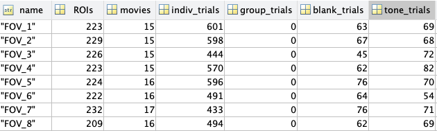

# Identifying neural ensembles from calcium imaging data 

A PhD rotation project aimed at identifying and characterizing neural ensembles in mouse primary somatosensory cortex (S1, barrel cortex) from 2-photon calcium imaging data recorded during whisker stimulation.

**Goal:** determine whether stimulus-evoked neural activity organizes into distinct and functionally connected neural ensembles. Neural ensmbles are defined as co-active groups of neurons that are functionally connected. Here I tested different detection methods (PCA vs. ICA vs. CRF) and preprocessing (binary spikes vs. spike probability) to see if that impacted neural ensemble identity and detection. 

**Approach:** infer spikes from raw calcium traces, then compare three ensemble-detection strategies: PCA + k-means clustering (the primary method, iterated and refined across three notebooks), Reconstruction ICA (RICA), and Conditional Random Fields (a method developed by the Yuste Lab for this class of problem). Each identified ensemble is characterized by its spatial organization across barrel columns and its whisker tuning.

## Notebooks

The analysis runs in MATLAB via a Jupyter MATLAB kernel; the `matlab/` folder holds the shared helper functions each notebook calls into.

| # | Notebook | What it does |
|---|---|---|
| 1 | [`01_spike_inference_preprocessing.ipynb`](01_spike_inference_preprocessing.ipynb) | Infers spike events from denoised dF/F traces using a per-ROI z-score threshold on the derivative; assembles the population array used by every notebook that follows. |
| 2 | [`02_eda_pca_exploration.ipynb`](02_eda_pca_exploration.ipynb) | Explores PCA across time bins and stimulus groupings to find the window that best separates whisker-evoked ensembles; introduces weighted PCA as a refinement. |
| 3 | [`03_ensemble_identification_and_characterization.ipynb`](03_ensemble_identification_and_characterization.ipynb) | The core analysis: k-means clustering on the PCA-projected population array (validated against a random-shuffle control and silhouette analysis), then characterizes each ensemble's spatial (barrel column) organization and whisker tuning. |
| 4 | [`04_refined_ensemble_detection.ipynb`](04_refined_ensemble_detection.ipynb) | Tests whether using graded spike probability, instead of a binary threshold, improves ensemble detection. |
| 5 | [`05_alternative_methods_rica_crf.ipynb`](05_alternative_methods_rica_crf.ipynb) | Benchmarks PCA + k-means against Reconstruction ICA and sets up Conditional Random Fields (Yuste Lab method) as further comparison points. |

Notebook 3 combines what were originally two separate working notebooks (ensemble identification, then characterization) into one continuous narrative, since the underlying analysis was really one pipeline split across two sessions. The full set of original, more granular notebooks is kept locally for my own reference (see [Notes on this repo](#notes-on-this-repo)).

## Data

A post-doctoral fellow's longitudinal 2-photon calcium imaging data: 2 mice, 4 fields of view (FOVs) each, 512x512 pixel FOV, 7.4811 Hz frame rate.



**Setup:** clone this repo, then download `calcium_data.mat` and `stimuli_info.mat` from [this Google Drive folder](https://drive.google.com/drive/folders/1O0PwG1FuS7czanlooS2ZPNizAnqvUCWR?usp=sharing) into a `data/` folder at the repo root (gitignored: the raw data isn't tracked in this repo).

**`calcium_data.mat`:** a 1x8 cell with a structure per FOV:
- `field_i.(ROIj).(movie_k).dff`: dF/F trace
- `field_i.(ROIj).(movie_k).deNoise_dff`: dF/F trace, denoised via the CaImAn algorithm
- `field_i.(ROIj).(movie_k).spike`: inferred spikes

**`stimuli_info.mat`:** a 1x8 cell with a structure per FOV:
- `FOV_i.movie_j.Label`: stimulus identity (018 = single whisker; 9 = all 9 whiskers; 10 = blank/spontaneous; 11, 12 = tone)
- `FOV_i.movie_j.Time`: frame number of stimulus onset

## Repository structure

```
Feldman-NeuralEnsembles/
├── README.md
├── 01_spike_inference_preprocessing.ipynb
├── 02_eda_pca_exploration.ipynb
├── 03_ensemble_identification_and_characterization.ipynb
├── 04_refined_ensemble_detection.ipynb
├── 05_alternative_methods_rica_crf.ipynb
├── main.m                  # standalone MATLAB entry point, mirrors the notebook pipeline
├── matlab/                 # shared helper functions (spike extraction, clustering, plotting)
├── documents/
│   └── dat_summary.png
└── data/                   # not tracked; download separately, see Data above
```

## Author

Laura Gomez ([neurogomez](https://github.com/neurogomez))
